# 🎶 MusicVJN

> **Music, with vision.** An AI-powered music practice assistant that analyzes vocal and instrumental performances using audio signal processing and machine learning. (Formerly "AI Music Practice Companion" — VJN is short for *vision*.)


---

## 📌 Overview

**MusicVJN** is a portfolio-ready, end-to-end audio analysis system designed to help musicians improve through data-driven feedback. Users upload audio recordings (vocals or guitar), and the system evaluates pitch accuracy, timing consistency, and vocal stability — returning scores, visualizations, and plain-English coaching tips.

This project is currently a **work in progress**. The API is backend-first and battle-tested; the frontend (Expo/React Native, runs on web + mobile) is under active development — see [Screenshots](#-screenshots) below for the current state of every screen.

---

## ✨ Features

- 🎵 Upload audio recordings (WAV recommended; MP3/M4A supported via ffmpeg)
- 🔄 Automatic audio preprocessing — mono conversion and resampling
- 🎼 Pitch tracking for both singing and guitar
- 🥁 Tempo and onset detection for timing analysis
- 📊 Vocal stability analysis for sustained notes
- 🔢 Numeric practice scores:
  - Pitch Accuracy
  - Timing Consistency
  - Vocal Stability
- 📈 Auto-generated visualizations:
  - Pitch-over-time plot
  - Onset timing plot
- 💾 Session-based results saved to disk (reproducible outputs)
- 📖 Interactive API documentation via Swagger UI

---

## 📸 Screenshots

Every screen in the app, captured from a production web build against a seeded demo account.

### Marketing / auth

| Landing page | Sign in |
|---|---|
| 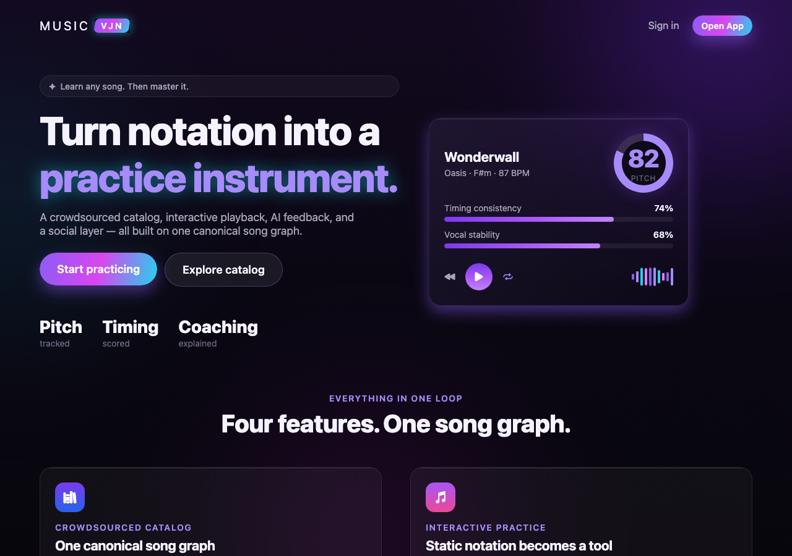 | 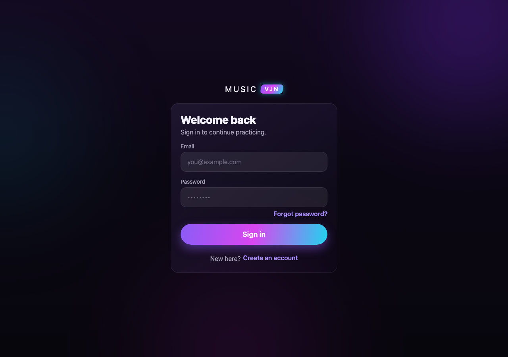 |

| Create account | Forgot password |
|---|---|
| 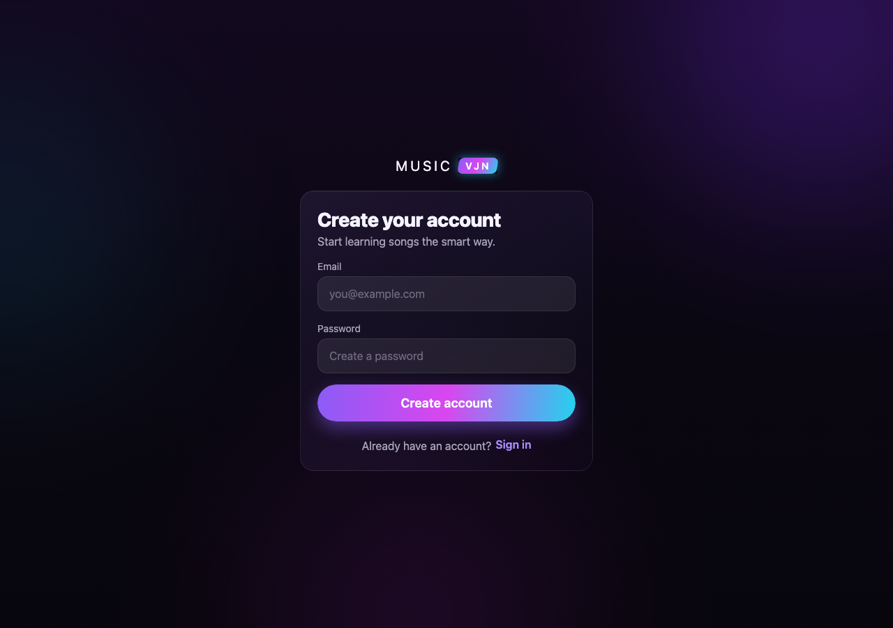 | 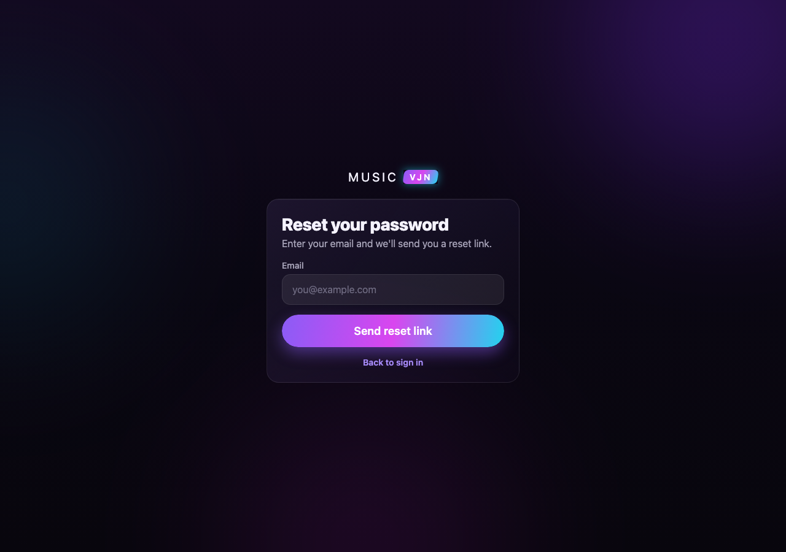 |

### Core app

| Discover | Analyze |
|---|---|
| 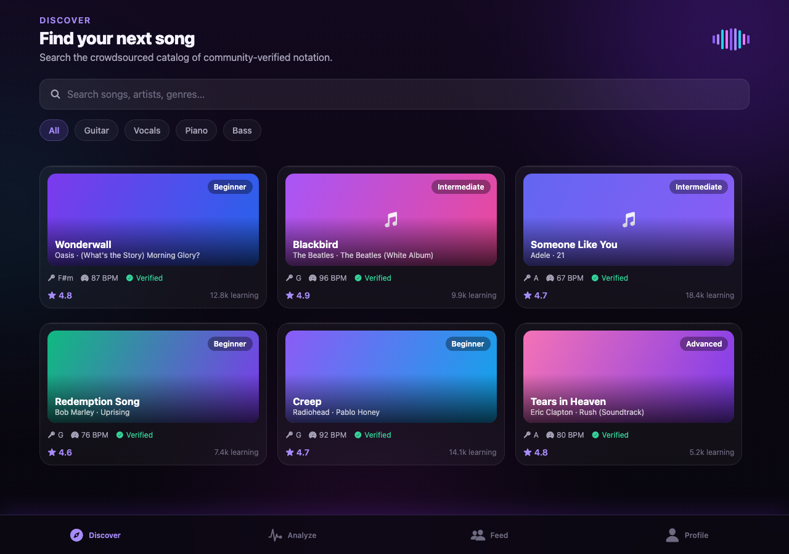 | 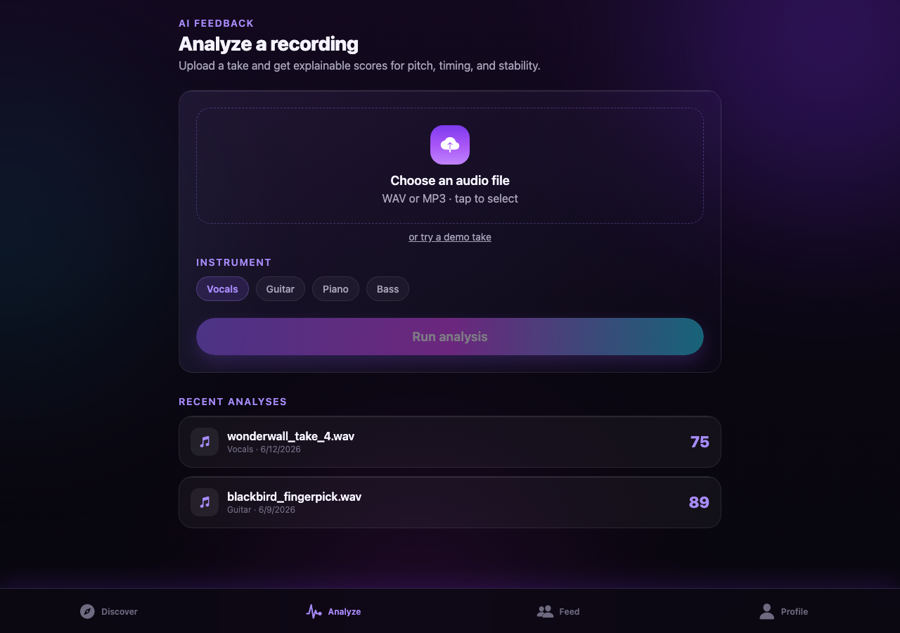 |

| Feed | Profile |
|---|---|
| 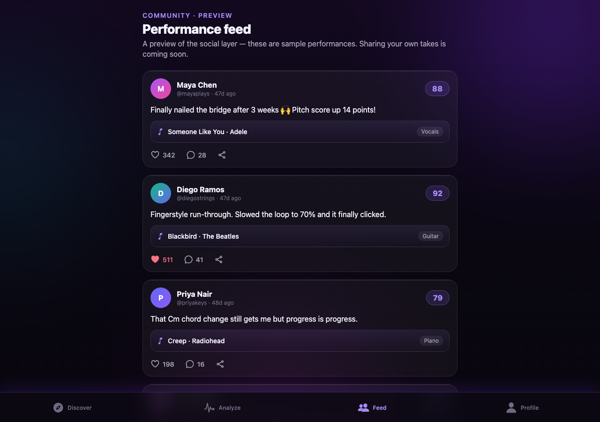 | 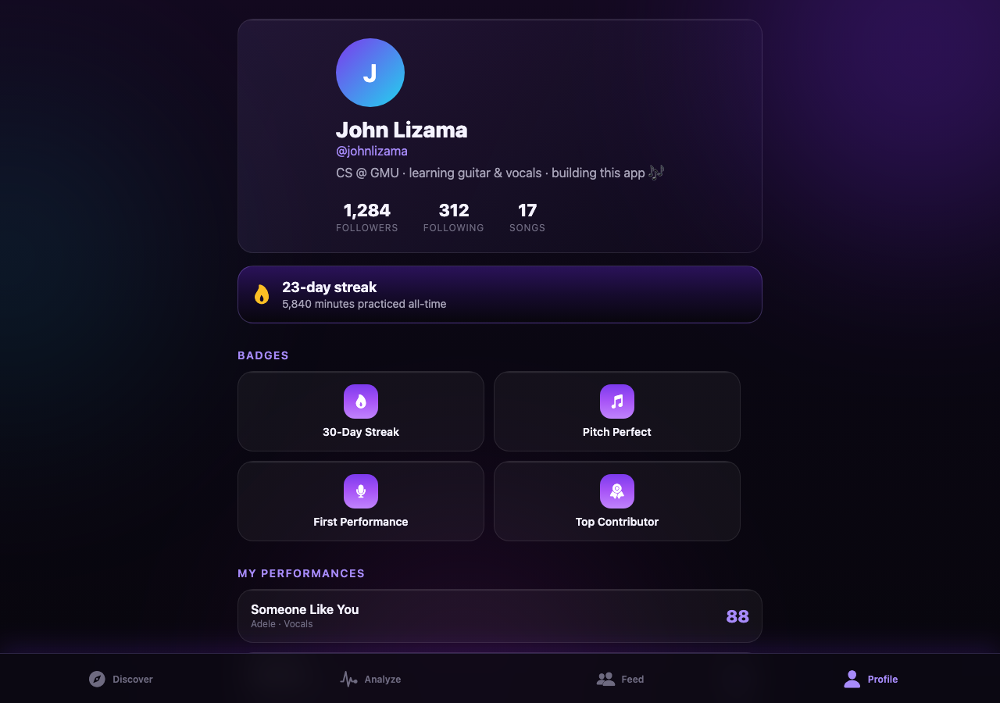 |

### Song + practice flow

| Song detail | Practice player |
|---|---|
| 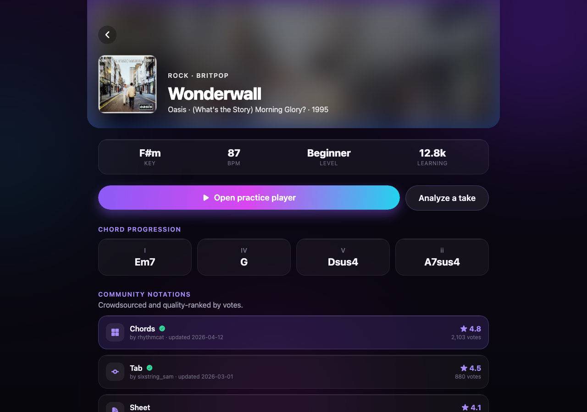 | 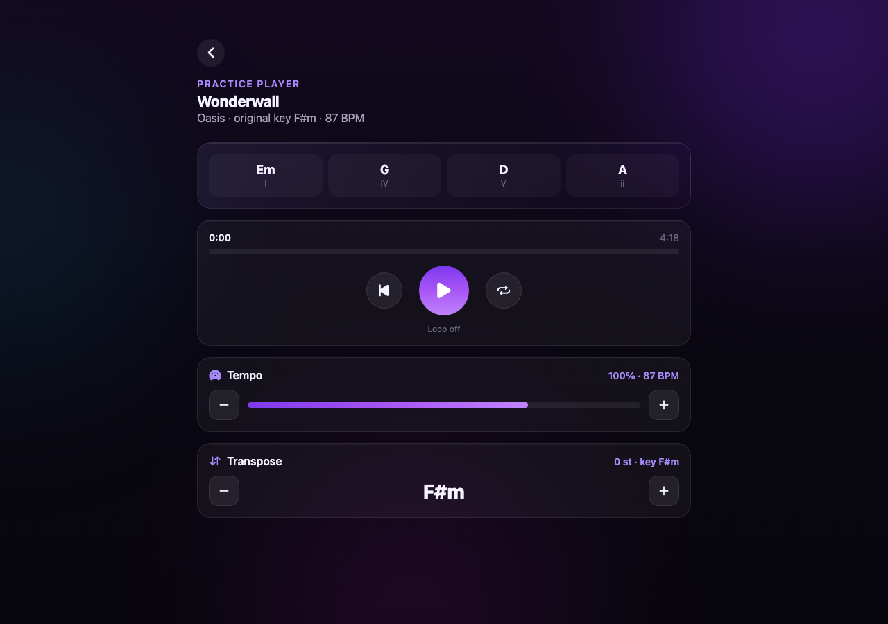 |

### Legal

| Privacy policy | Terms of service |
|---|---|
| 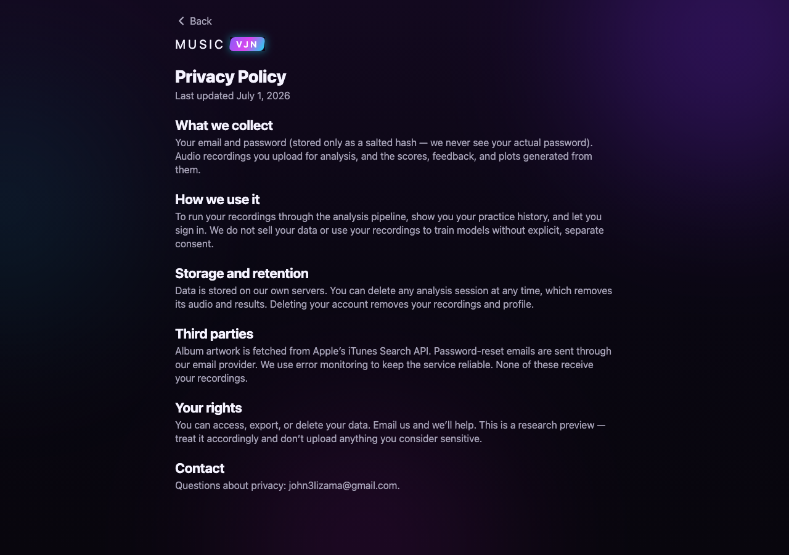 | 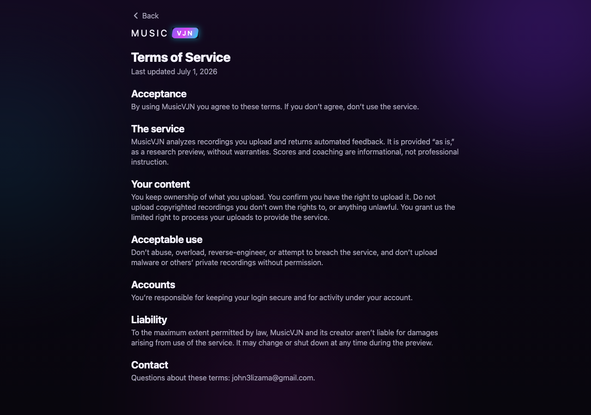 |

---

## 🧠 How It Works

1. **Upload** — User submits an audio file via the `/api/analyze` endpoint
2. **Preprocess** — Audio is normalized to mono and resampled for consistency
3. **Analyze** — Core signal processing extracts pitch, onsets, tempo, and stability metrics
4. **Score** — Explainable heuristics convert raw features into practice scores
5. **Feedback** — Scores are translated into plain-English coaching tips
6. **Save** — All results (JSON + plots) are persisted to a unique session folder

Each analysis run produces a fully reproducible session folder under `api/app/outputs/sessions/<session_id>/`.

---

## 🛠️ Tech Stack

### Backend
| Library       | Purpose                          |
|---------------|----------------------------------|
| Python 3      | Core language                    |
| FastAPI       | API framework                    |
| librosa       | Audio feature extraction         |
| NumPy / SciPy | Signal processing                |
| matplotlib    | Visualization                    |
| ffmpeg        | Audio format conversion          |
| Pydantic      | Data validation & API schemas    |

### Frontend
| Library         | Purpose                          |
|-----------------|-----------------------------------|
| Expo / React Native | Cross-platform app (web + iOS/Android) |
| expo-router     | File-based navigation             |
| TypeScript      | Type-safe components + API client |
| Playwright      | End-to-end tests for the web build |

---

## 📁 Project Structure

```
music-practice-ai/
├── api/
│   ├── requirements.txt
│   └── app/
│       ├── main.py                  # FastAPI app entry point
│       ├── routes/
│       │   ├── analyze.py           # POST /api/analyze endpoint
│       │   └── sessions.py          # Session retrieval endpoints
│       ├── services/
│       │   └── analysis_service.py  # Orchestrates analysis pipeline
│       ├── core/
│       │   ├── audio_io.py          # Load, convert, normalize audio
│       │   ├── features.py          # Pitch, onsets, MFCC extraction
│       │   ├── scoring.py           # Convert features → practice scores
│       │   ├── feedback.py          # Convert scores → coaching tips
│       │   └── plots.py             # Generate visualizations
│       ├── models/
│       │   └── schemas.py           # Pydantic request/response DTOs
│       └── outputs/
│           └── sessions/            # Generated session outputs (gitignored)
└── web/                             # Frontend — React/Vite (planned)
```

> **Architecture principle:** `routes/` handles HTTP only → `services/` orchestrates logic → `core/` contains pure, testable functions. No FastAPI imports in `core/`.

---

## 🚀 Getting Started

### Prerequisites

- Python 3.10+
- [ffmpeg](https://ffmpeg.org/) installed on your system

### Installation

```bash
# Clone the repository
git clone https://github.com/john3lizama/Music_Practice_Companion.git
cd Music_Practice_Companion/api

# Install ffmpeg (macOS)
brew install ffmpeg

# Create and activate virtual environment
python3 -m venv .venv
source .venv/bin/activate  # On Windows: .venv\Scripts\activate

# Install Python dependencies
pip install -r requirements.txt
```

### Running the API

```bash
uvicorn app.main:app --reload
```

Then open **http://127.0.0.1:8000/docs** to access the Swagger UI and test the `/api/analyze` endpoint by uploading an audio file.

---

## 📊 Example Output

Each analysis session returns:

| File           | Description                              |
|----------------|------------------------------------------|
| `result.json`  | Scores, metadata, and feedback text      |
| `pitch.png`    | Pitch-over-time visualization            |
| `onsets.png`   | Timing and onset visualization           |

**Example feedback messages:**
- *"Pitch is generally stable but drifts during sustained notes."*
- *"Timing inconsistency detected — try practicing with a metronome."*

---

## 🧩 Design Philosophy

- **Explainable AI first** — simple, interpretable metrics over black-box models
- **Clean separation of concerns** — API / services / core logic are fully decoupled
- **Session-based outputs** — every run is reproducible and independently inspectable
- **Expandable architecture** — designed to plug in ML models and a web UI later

---

## 🔮 Roadmap

- [ ] Web UI for uploading audio and browsing session history
- [ ] Real-time recording directly in the browser
- [ ] ML-based scoring models to replace heuristics
- [ ] Personalized practice recommendations over time
- [ ] User accounts and progress tracking
- [ ] Support for reference tracks and backing tracks
- [ ] CI/CD pipeline and cloud deployment (AWS EC2)

---

## 👤 Author

**John Lizama**
Computer Science (AI/ML) — George Mason University
[GitHub](https://github.com/john3lizama)

---

## 📄 License

This project is intended for educational and portfolio purposes.
