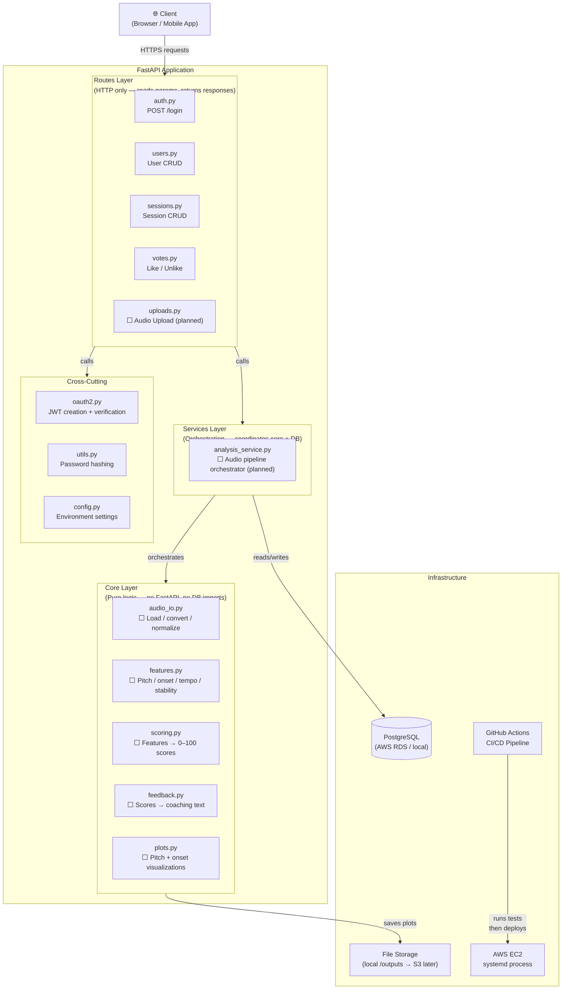
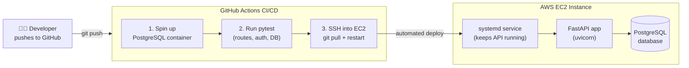

# 02 — System Architecture

## Component Diagram

This diagram shows the high-level layers of the system and how they relate to each other. Arrows represent the direction of dependency — a layer only calls inward, never outward.

---

## Layer Responsibilities

| Layer | Files | Rule |
|---|---|---|
| **Routes** | `routes/*.py` | HTTP only. Read request params, call a service or query, return a response. No business logic. |
| **Services** | `services/*.py` | Glue code. Coordinate core functions in the right order. Persist results. Handle status updates. |
| **Core** | `core/*.py` | Pure functions. Audio math, scoring logic, feedback rules. Zero FastAPI or SQLAlchemy imports. |
| **Models** | `models/__init__.py` | SQLAlchemy ORM table definitions. One class per database table. |
| **Schemas** | `schemas/schemas.py` | Pydantic models for request/response validation and serialization. |
| **Cross-Cutting** | `oauth2.py`, `utils.py`, `config.py` | Auth, hashing, and environment config used across multiple layers. |

---

## Deployment Architecture

---

## What ⬜ Means

Files marked with ⬜ are **designed but not yet implemented**. Their interfaces and responsibilities are defined in the documentation and scaffolded in the codebase. See `06_data_pipeline.md` for the full design of the audio core layer.
