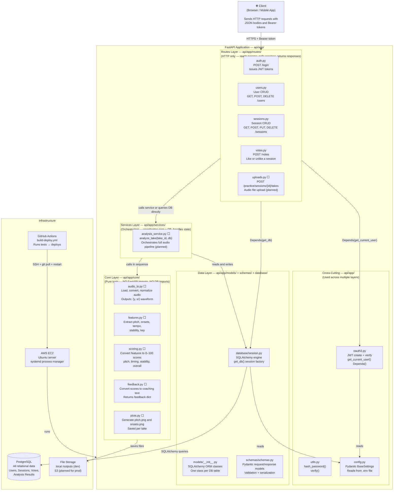
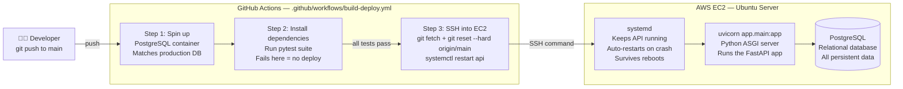

# 02 — System Architecture

**Who this is for:** A developer who needs to understand how the application layers connect, why they are separated the way they are, and what the rules are for where logic belongs.

---

## Why Architecture Matters Here

This project has two distinct concerns that could easily get tangled together: **web API logic** (HTTP, auth, routing) and **audio processing logic** (signal processing, scoring, feedback). If these mix into the same files, the result is code that is impossible to test independently, impossible to swap out, and extremely hard to debug.

The layered architecture exists to enforce a clear boundary between them. A route file never does math on audio. A core function never touches the database. When something breaks, you know exactly which layer to look in.

---

## Component Diagram

This diagram shows every major component in the system and how they depend on each other. The arrow direction means "depends on" or "calls." Notice that dependencies only point inward — a route calls a service, a service calls core functions. Nothing calls backward.

---

## Layer Rules — Where Logic Belongs

This is the most important section for any developer adding new features. Putting logic in the wrong layer is the most common mistake in this codebase.

### Routes Layer — `api/app/routes/`

**Purpose:** The routes layer is the HTTP boundary. Its only job is to translate between HTTP and Python — reading request parameters, validating input, calling the right function, and formatting the response.

**What belongs here:**
- Reading path parameters, query parameters, and request bodies
- Calling `Depends(get_current_user)` for authentication
- Calling `Depends(get_db)` to get a database session
- Calling a service function or making a simple database query
- Raising `HTTPException` for 404, 403, 409 errors
- Returning response data

**What does NOT belong here:**
- Any audio processing logic
- Any business rules or calculations
- Direct calls to librosa, NumPy, or any audio library
- Complex multi-step database operations

**Example:** `api/app/routes/sessions.py` handles GET/POST/PUT/DELETE for sessions. The route reads the request, validates the user's token, queries the database, and returns. No audio logic anywhere.

---

### Services Layer — `api/app/services/`

**Purpose:** Services are the orchestration layer — they coordinate multiple steps that need to happen in a specific order. The key rule is that this is the ONLY layer that knows about both core audio functions AND the database. Routes don't touch audio. Core doesn't touch the database. Services bridge them.

**What belongs here:**
- Calling core functions in the right sequence
- Updating database records to reflect processing state (e.g., setting take status to "processing")
- Persisting results after core functions complete
- Error handling and cleanup (e.g., marking a take as "failed" if audio processing crashes)
- Coordinating file I/O paths between upload storage and core processing

**What does NOT belong here:**
- Any HTTP-specific logic (no `Request`, `Response`, `HTTPException`)
- The actual audio math (that lives in `core/`)

**Example:** `analysis_service.py` will call `audio_io.load_audio()`, then `features.extract_pitch()`, then `scoring.score_pitch()`, then `feedback.generate_all_feedback()`, then save everything to the database. It orchestrates — it does not compute.

---

### Core Layer — `api/app/core/`

**Purpose:** Pure functions. Every function in `core/` takes data in and returns data out — no side effects, no database calls, no HTTP context. This is deliberate. It means every core function can be unit tested with a single assert statement, imported into a Jupyter notebook for exploration, or replaced entirely without touching any route or service.

**What belongs here:**
- Audio loading and normalization
- Signal processing (pitch extraction, onset detection, beat tracking)
- Score computation (math on audio features)
- Feedback generation (string logic based on scores)
- Plot generation (matplotlib output to file)

**What does NOT belong here:**
- `from fastapi import ...` — never
- `from sqlalchemy import ...` — never
- Any database query
- Any HTTP response logic

**Example:** `features.extract_pitch(y, sr)` takes a waveform array and returns a pitch array. It doesn't care where the audio came from, who uploaded it, or what happens to the result. It just computes.

---

### Data Layer — `api/app/models/`, `api/app/schemas/`, `api/app/database/`

**Why models and schemas are separate — this is a common point of confusion.**

Models (`models/__init__.py`) define what the database looks like. They use SQLAlchemy and map directly to PostgreSQL tables. You use a model when reading from or writing to the database.

Schemas (`schemas/schemas.py`) define what the API looks like. They use Pydantic and define what the client can send and what they receive back. You use a schema as a route's `response_model` or as the type of a request body parameter.

These are intentionally different because the database shape and the API shape are not always the same thing. The database stores a hashed password — the API should never return it. The database stores a raw `feedback` string (JSON) — the API should return it as a structured `FeedbackOut` object. Keeping them separate means these transformations are explicit and controlled.

The database session factory lives in `database/session.py`. The `get_db()` function there is a FastAPI dependency that creates a database session per request and closes it when the request finishes, regardless of whether it succeeded or failed.

---

## Deployment Architecture

**Why this pipeline matters:** The CI/CD setup means that no one manually SSHes into the server to deploy. Every push to `main` that passes tests is automatically deployed. This prevents the "it works on my machine" problem and ensures the deployed code always matches the tested code.

**Why systemd instead of Docker?** Docker deployment is scaffolded in the CI/CD file (commented out) for a future enhancement. For now, systemd is simpler to configure, easier to debug on a single server, and sufficient for the current scale. When traffic grows or the deployment needs to be containerized, Docker can be enabled by uncommenting those steps in `build-deploy.yml`.

---

## What ⬜ Means Throughout the Docs

Files and components marked with ⬜ are **designed and documented but not yet implemented**. Their location in the codebase is established (the file exists), their interface is designed (inputs and outputs are defined in `06_data_pipeline.md`), and their role in the architecture is clear. They are ready to be built. See `06_data_pipeline.md` for the implementation spec.
