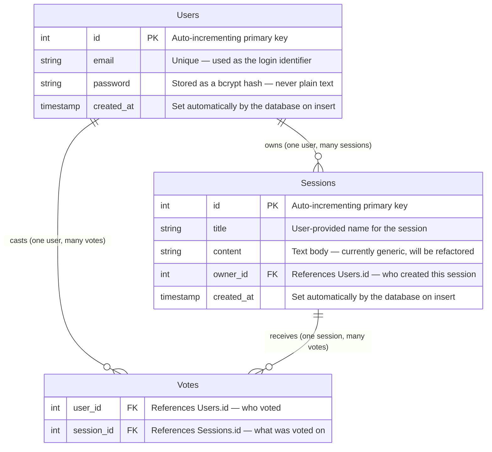
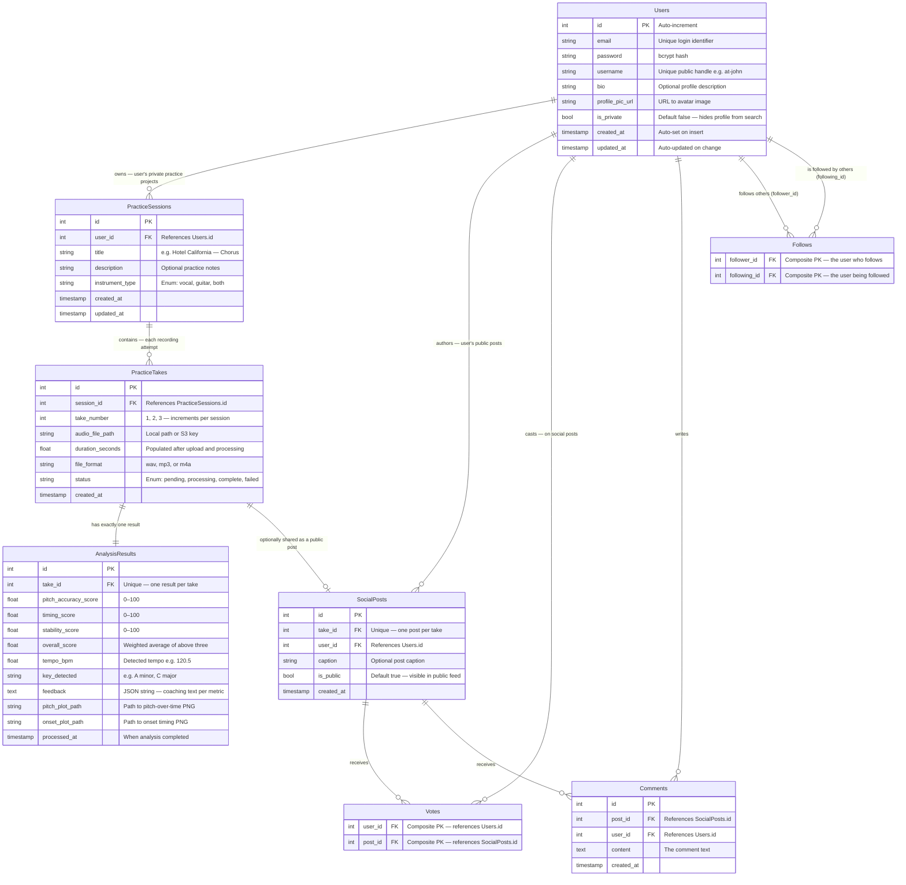

# 03 — Entity Relationship Diagram (ERD)

**Who this is for:** A developer who needs to understand the database structure — what tables exist, what each column stores, and how tables relate to each other. This is the reference to consult before writing any database query or adding a new column.

**Where to find the code:** All current database tables are defined as SQLAlchemy classes in `api/app/models/__init__.py`. The database connection is configured in `api/app/database/session.py`. Schema migrations are managed by Alembic.

---

## Why a Relational Database

The data in this system has clear, structured relationships — a user owns sessions, a session contains takes, a take has one analysis result, and social posts are built on top of takes. PostgreSQL and a relational schema are the right tool here because these relationships need to be enforced at the database level (via foreign keys), not just in application code. A user should never be able to accidentally see another user's private takes, and a take should never exist without a parent session — the database enforces these constraints automatically.

---

## Current Database Schema

This is the database as it exists and runs in production today. Every table here has a corresponding SQLAlchemy class in `api/app/models/__init__.py`.

### Relationship Explanation — Current Schema

**Users → Sessions (one-to-many)**
One user account can own any number of practice sessions. The `owner_id` column on `Sessions` is a foreign key pointing back to `Users.id`. The `ondelete="CASCADE"` setting means if a user account is deleted, all their sessions are automatically deleted too — no orphaned records.

**Users → Votes (one-to-many)**
One user can cast votes on many sessions. Again, cascade delete ensures votes are cleaned up if the user is deleted.

**Sessions → Votes (one-to-many)**
One session can receive many votes from different users. The `Votes` table is a join table — it has no primary key column of its own. Instead, the combination of `(user_id, session_id)` forms a composite primary key. This is what prevents the same user from voting on the same session twice — the database itself rejects the duplicate insert.

**Important note about naming:** The current `Sessions` table is named generically because it was built as the foundation. It stores `title` and `content` fields borrowed from a tutorial structure. In the planned schema, this is replaced by `PracticeSessions` with domain-specific fields. The current table will be migrated — see the planned schema below.

---

## Planned Database Schema

This is the full designed schema representing where the database is headed. These tables have not been created yet — they require Alembic migrations. The design rationale for each table is explained after the diagram.

---

## Planned Schema — Design Rationale

### Why `Users` gets new columns
The current `Users` table only stores what is needed for login (email, password). To support a social platform, users need a public identity: a `username` for the @handle, a `bio`, and a `profile_pic_url`. The `is_private` flag allows users to hide their profile from search and follows, mirroring how Instagram private accounts work.

### Why `PracticeSessions` replaces `Sessions`
The current `Sessions` table is a generic CRUD table with `title` and `content`. The planned `PracticeSessions` table models the actual domain — a named practice project with an `instrument_type` enum (`vocal`, `guitar`, `both`). This distinction matters for the audio pipeline, which may need to apply different pitch detection settings for guitar versus vocal recordings.

### Why `PracticeTakes` exists as a separate table
A session can have multiple recording attempts. A musician might practice the same chorus three times in one session. Each attempt is a `PracticeTake`. By separating takes from sessions, the system can show a history of all attempts within a session, track how scores improve across attempts, and allow the user to share any specific take — not just the latest one.

### Why `AnalysisResults` is one-to-one with `PracticeTakes`
Each take gets exactly one analysis result. The `unique=True` constraint on `take_id` enforces this at the database level. This prevents duplicate analysis jobs from creating duplicate result records. The `status` field on `PracticeTakes` (`pending → processing → complete → failed`) is the mechanism for knowing whether the analysis has run yet.

### Why `SocialPosts` is a separate table from `PracticeSessions`
The social layer is intentionally decoupled from the private practice layer. A `SocialPost` is created only when a user explicitly chooses to share a take. It references the take, but the take knows nothing about whether it has been shared. This means the social feed can evolve independently — adding comments, shares, duets — without touching the private practice schema. The `unique=True` constraint on `take_id` in `SocialPosts` ensures a take can only be posted once.

### Why `Votes` moves from `Sessions` to `SocialPosts`
In the current schema, users vote on `Sessions`. In the planned schema, users vote on `SocialPosts`. This is the critical migration that needs to happen when the social layer is built. The composite primary key pattern stays the same — `(user_id, post_id)` prevents duplicate votes.

### Why `Follows` uses a composite key without a separate PK
The `Follows` table represents a directed graph — user A follows user B. There is no other data to store. The composite primary key `(follower_id, following_id)` is the entire record. This also enforces at the database level that the same follow relationship cannot be created twice.
