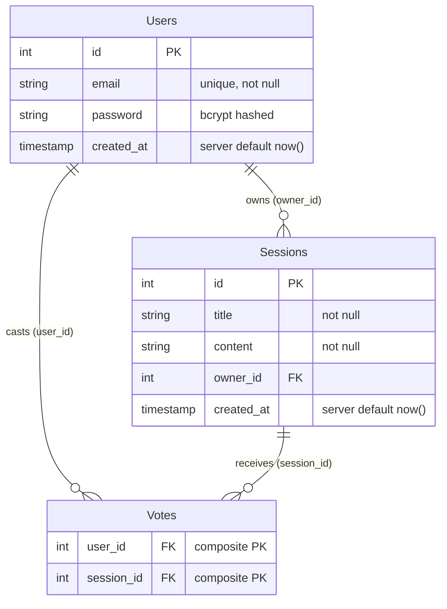
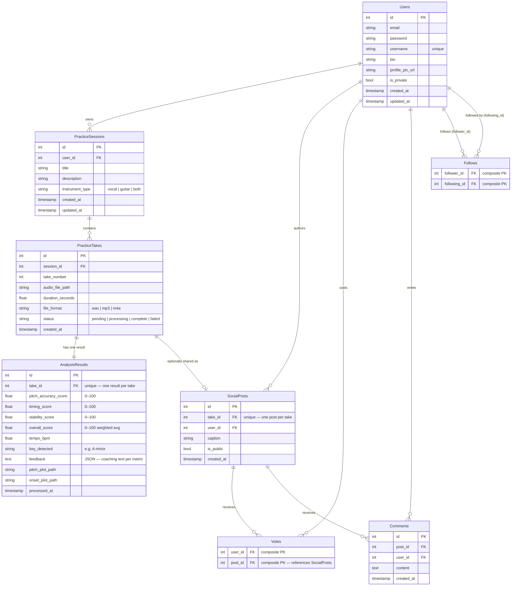

# 03 — Entity Relationship Diagram (ERD)

## Current Database Schema

This diagram reflects the database as it exists today. Tables and columns map directly to the SQLAlchemy models in `api/app/models/__init__.py`.

---

## Relationship Notes

**Users → Sessions** — One user can own many sessions. If a user is deleted, their sessions are cascade-deleted (`ondelete="CASCADE"`).

**Users → Votes** — One user can vote on many sessions. Cascade-deleted with the user.

**Sessions → Votes** — One session can receive many votes. Votes are cascade-deleted when a session is deleted.

**Votes composite PK** — The combination of `(user_id, session_id)` is the primary key, which enforces that a user can only vote once per session at the database level.

---

## Planned Schema Additions

The following tables are designed and documented but not yet implemented. See `06_data_pipeline.md` for the full design rationale.

---

## Key Design Decisions

**PracticeTakes are the central unit** — A take is a single recording attempt. Everything flows from it: the analysis result hangs off it one-to-one, and a social post references it when the user chooses to share.

**SocialPosts are decoupled from PracticeSessions** — This means the social layer doesn't need to know anything about the private practice structure. A user can share a take without exposing any other information about their session.

**Votes migrate from Sessions to SocialPosts** — In the current schema, votes reference sessions. In the planned schema, votes reference social posts. This is the primary migration needed when the social layer is built.

**AnalysisResults uses a unique FK on take_id** — Enforces at the database level that one take can only ever have one analysis result, preventing duplicate processing.
