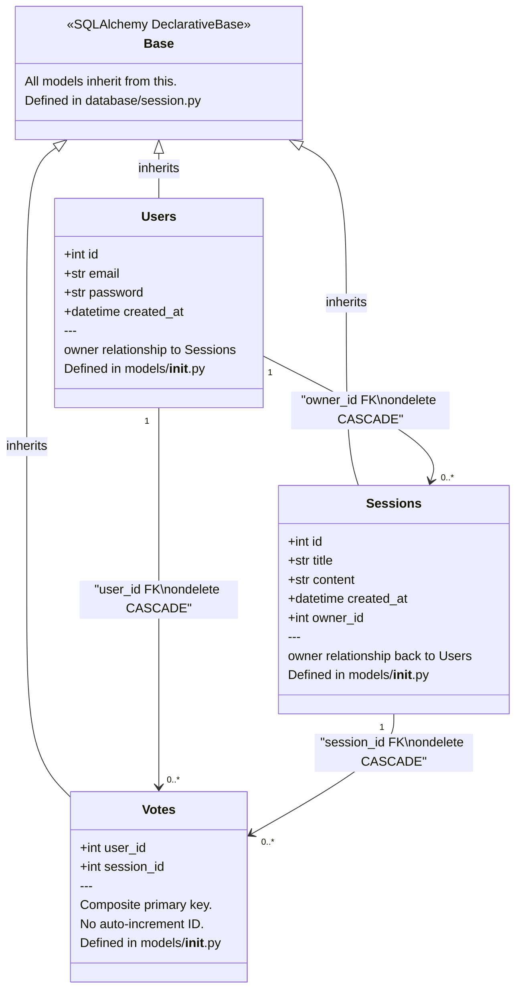
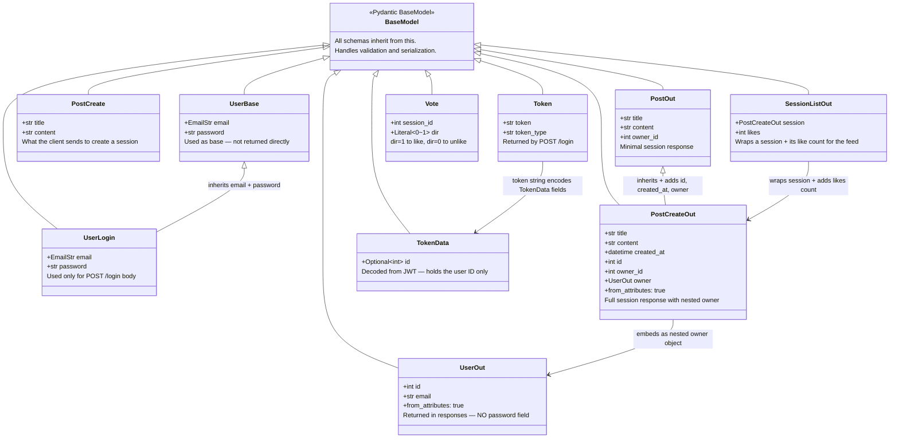
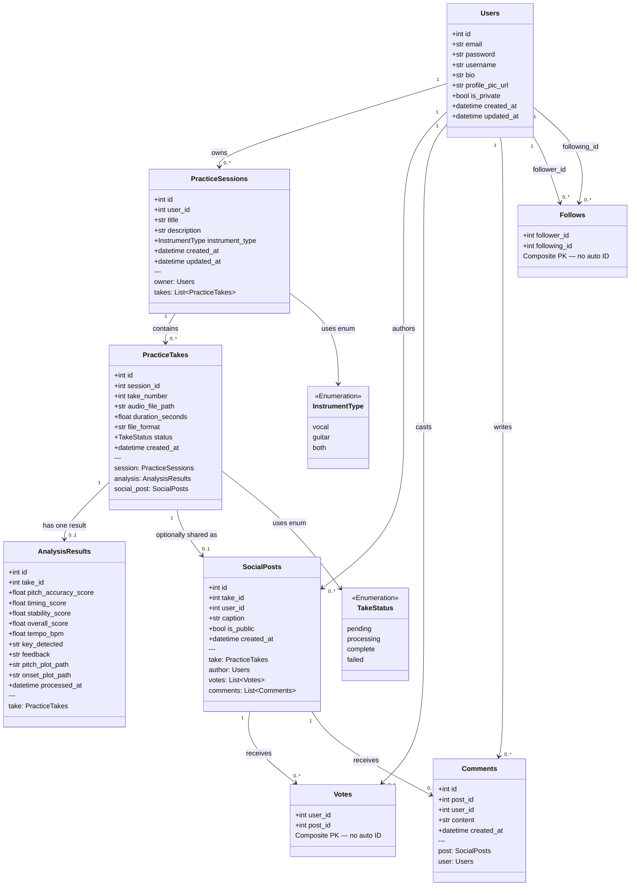
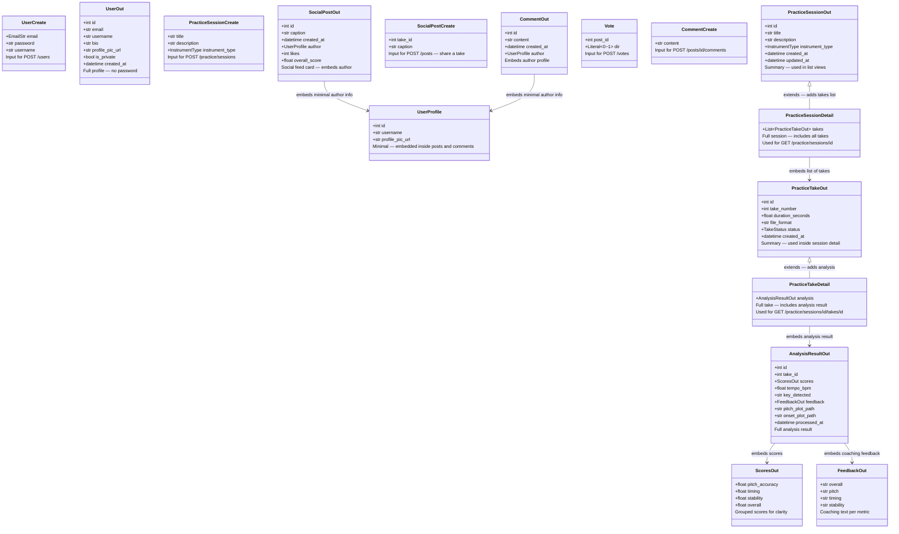

# 04 — Class Diagram

**Who this is for:** A developer who needs to understand the code-level structure of the data layer — how database models are defined, how API schemas are defined, what the difference between them is, and how they relate to each other.

**Where to find the code:**
- ORM Models → `api/app/models/__init__.py`
- Pydantic Schemas → `api/app/schemas/schemas.py`
- Database session → `api/app/database/session.py`

---

## The Critical Distinction: Models vs. Schemas

This is the most common point of confusion for developers new to FastAPI + SQLAlchemy. **They are not the same thing and they should never be merged.**

**ORM Models** (SQLAlchemy) define what the **database** looks like. Each class maps to a PostgreSQL table. Each attribute maps to a column. When you query the database, you get back a model instance. When you insert data, you create a model instance and add it to the session.

**Pydantic Schemas** define what the **API** looks like — what the client can send in a request body and what they receive back in a response. A schema is what FastAPI validates against before any database code runs. A schema is what FastAPI serializes into JSON before sending a response.

**Why keep them separate?** Because the database shape and the API shape are intentionally different in several ways:

- The database stores `password` as a hashed string. The API should **never return it** — `UserOut` doesn't include `password`.
- The database stores `feedback` as a raw JSON text string. The API returns it as a structured `FeedbackOut` object with named fields.
- The database uses integer IDs and foreign key columns. The API often returns nested objects instead (e.g., `PostCreateOut` embeds a full `UserOut` for the owner instead of just `owner_id`).
- Some API schemas represent operations (e.g., `PostCreate` for creating a session) that don't map to any single table — they only contain the fields the client provides.

---

## Current ORM Models

These are the SQLAlchemy classes that exist in `api/app/models/__init__.py` today. Each class inherits from `Base` (defined in `database/session.py`), which registers it with SQLAlchemy so it can be translated into a database table.



**How relationships work in SQLAlchemy:**
The `owner = relationship("Users")` line on the `Sessions` class tells SQLAlchemy to automatically load the related `Users` record when you access `session.owner`. This is called a lazy-loaded relationship — the JOIN query happens when you access the attribute, not when you query the session. The `PostCreateOut` schema uses this by embedding a full `UserOut` object in the response.

---

## Current Pydantic Schemas

These are the request/response validation schemas in `api/app/schemas/schemas.py`. Each class inherits from Pydantic's `BaseModel`. When `model_config = ConfigDict(from_attributes=True)` is set, Pydantic can convert a SQLAlchemy model instance directly into the schema — this is how route responses work.



**How a route uses these schemas:**

```python
# In routes/sessions.py:
@router.post("/", response_model=PostOut)           # ← FastAPI serializes response as PostOut
async def create_session(post: PostCreate, ...):    # ← FastAPI validates input as PostCreate
```

FastAPI uses the `response_model` to filter and serialize the return value. Even if the function returns a full SQLAlchemy `Sessions` object with many fields, FastAPI will only include the fields declared in `PostOut`.

---

## Planned ORM Models

These models represent the full designed schema. They extend the current models with domain-specific fields and add the tables needed for audio analysis and social features. See `03_erd.md` for the database-level design and `06_data_pipeline.md` for the audio pipeline design.



---

## Planned Pydantic Schemas

These schemas align with the planned models. Notice how the nesting reflects the relationships — a `PracticeSessionDetail` embeds a list of `PracticeTakeOut` objects, and a `PracticeTakeDetail` embeds an `AnalysisResultOut`. This is intentional: the API response mirrors the data relationships without exposing raw foreign key IDs.



**Why `UserProfile` instead of `UserOut` inside posts?**
When the API returns a list of 20 social posts, embedding the full `UserOut` (with bio, privacy settings, created date) for every post author would bloat the response significantly. `UserProfile` is a minimal projection — just enough to render an avatar and a username link in the UI. The full profile is only fetched when navigating to `GET /users/{username}`.

**Why `ScoresOut` and `FeedbackOut` as nested objects inside `AnalysisResultOut`?**
Grouping scores under a `scores` key and feedback under a `feedback` key makes the API response self-documenting and easy to consume in a frontend. Instead of a flat list of `pitch_accuracy_score`, `timing_score`, etc., the client receives a structured object that mirrors how the data is logically organized. This also makes it easy to add new metrics later without breaking existing clients.
