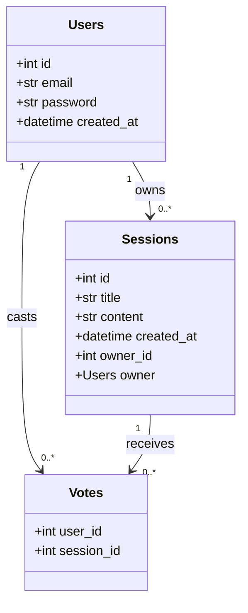
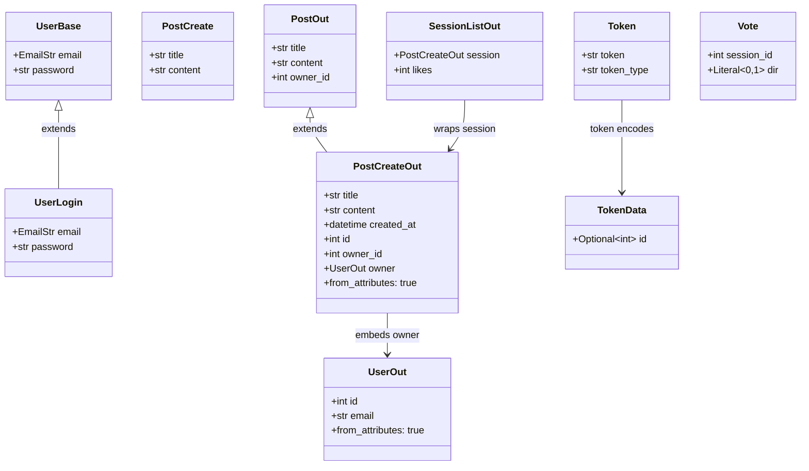
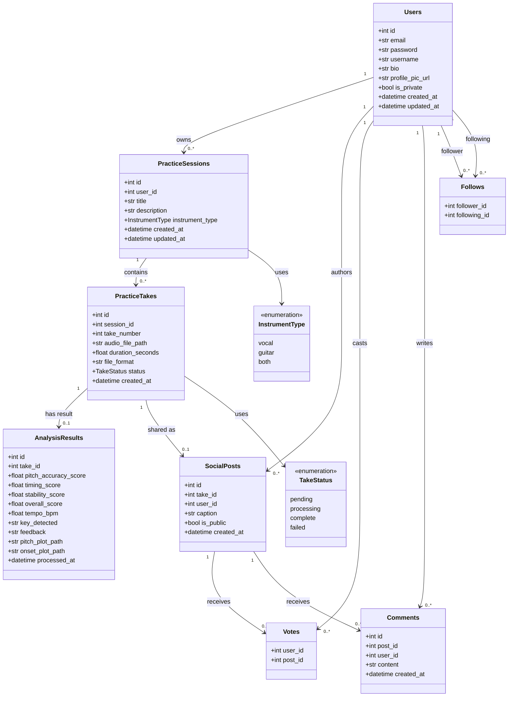
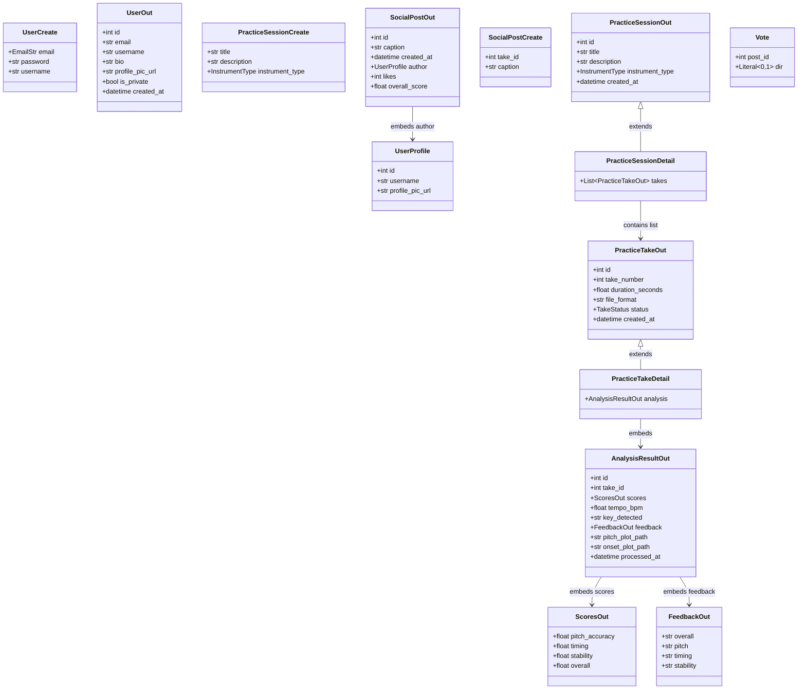

# 04 — Class Diagram

## Overview

This document shows two separate class diagrams:

1. **ORM Models** — SQLAlchemy classes that map to database tables (`models/__init__.py`)
2. **Pydantic Schemas** — Request/response contracts used at the API boundary (`schemas/schemas.py`)

They are kept separate because they serve different purposes. Models represent the database shape. Schemas represent what the API accepts and returns — they are not always the same thing.

---

## ORM Models (Current)

These are the SQLAlchemy classes that exist in the codebase today.

---

## Pydantic Schemas (Current)

These are the request/response validation schemas used by the API routes today.

---

## Planned ORM Models

These models represent the full planned schema. They are documented here for design purposes and will be implemented via Alembic migrations.

---

## Planned Pydantic Schemas

