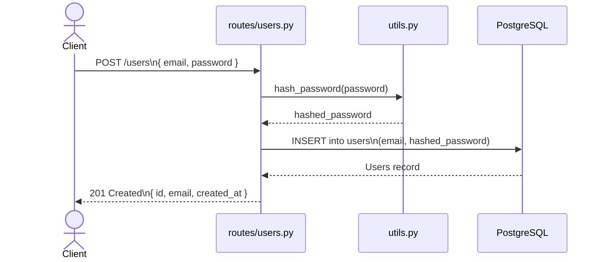
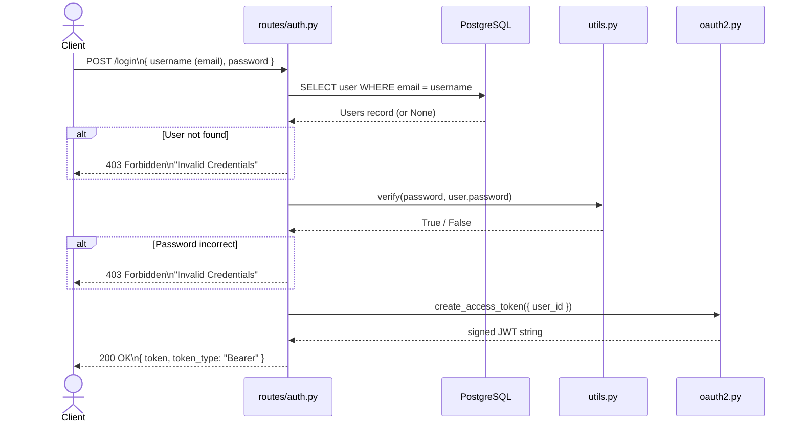
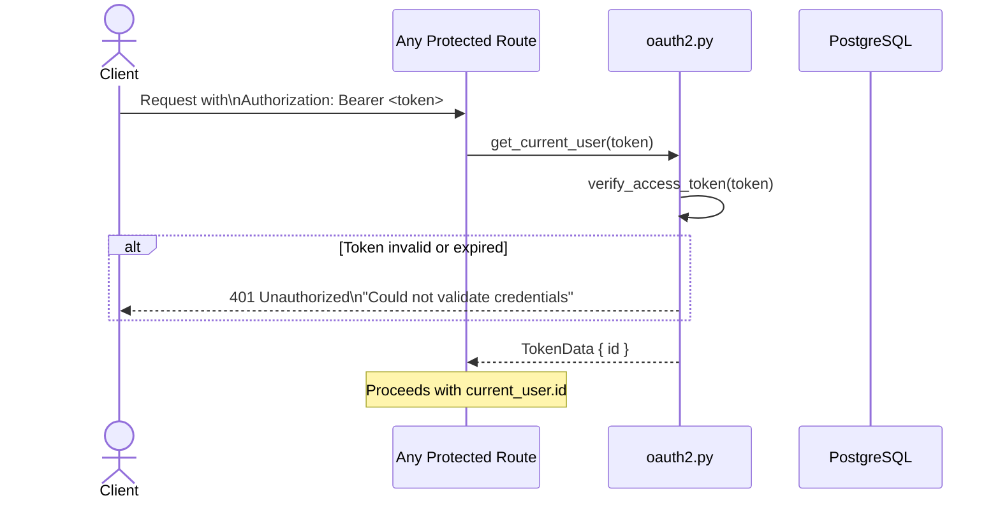
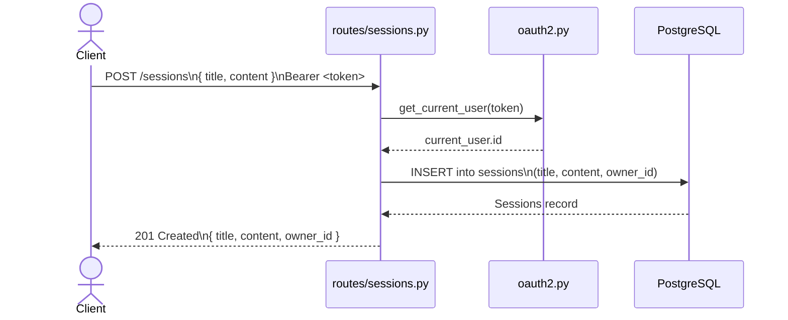
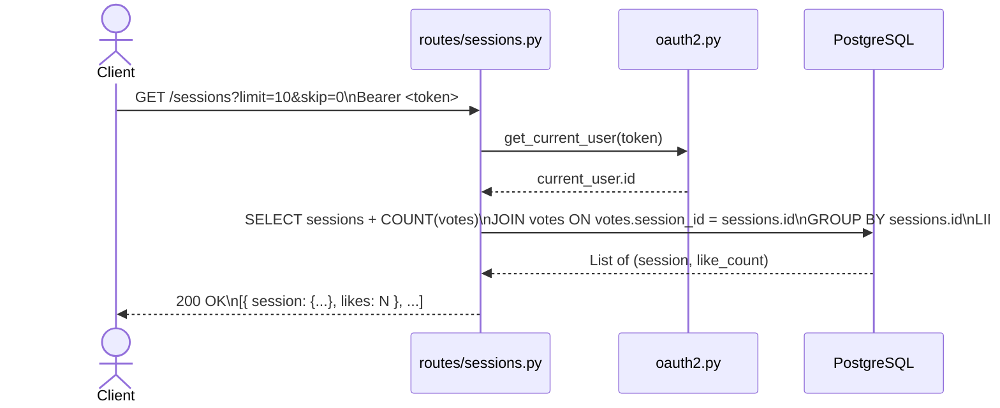
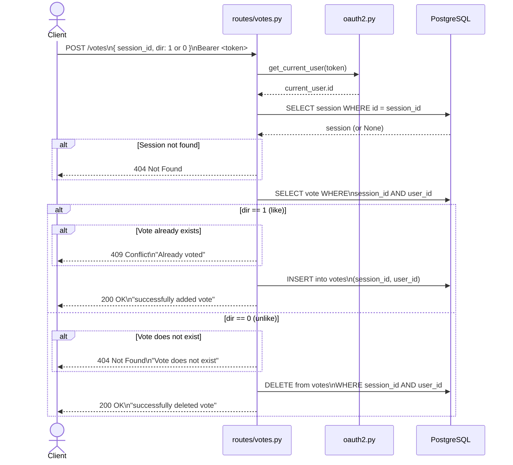
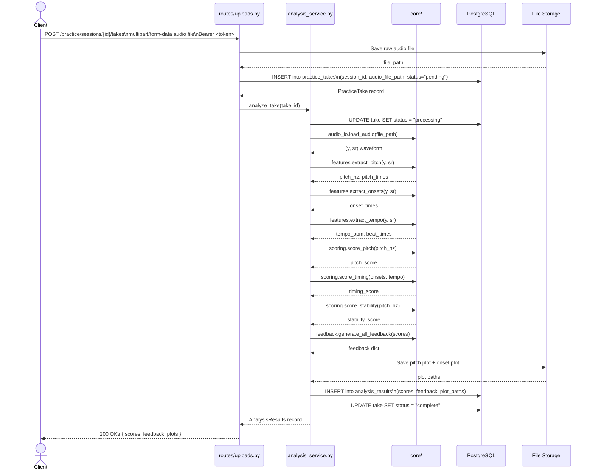

# 05 — Sequence Diagrams

## Overview

Each diagram shows how a specific request flows through the system from the client to the database and back. Actors are labeled by their layer to reinforce the architecture.

---

## 1. User Registration

---

## 2. User Login — JWT Authentication

---

## 3. Authenticated Request — Token Verification

This flow is used by every protected route (sessions, votes, etc.) before any business logic runs.

---

## 4. Create a Practice Session

---

## 5. Get All Sessions (with Like Counts)

---

## 6. Vote on a Session (Like / Unlike)

---

## 7. Audio Upload + Analysis (Planned)

This flow does not exist yet. It represents the intended behavior once the audio pipeline is implemented. See `06_data_pipeline.md` for the internal design of the analysis step.

