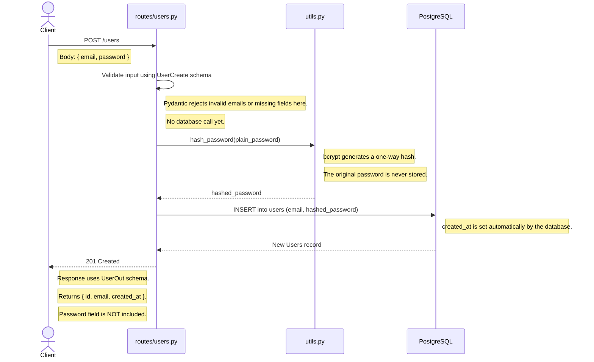
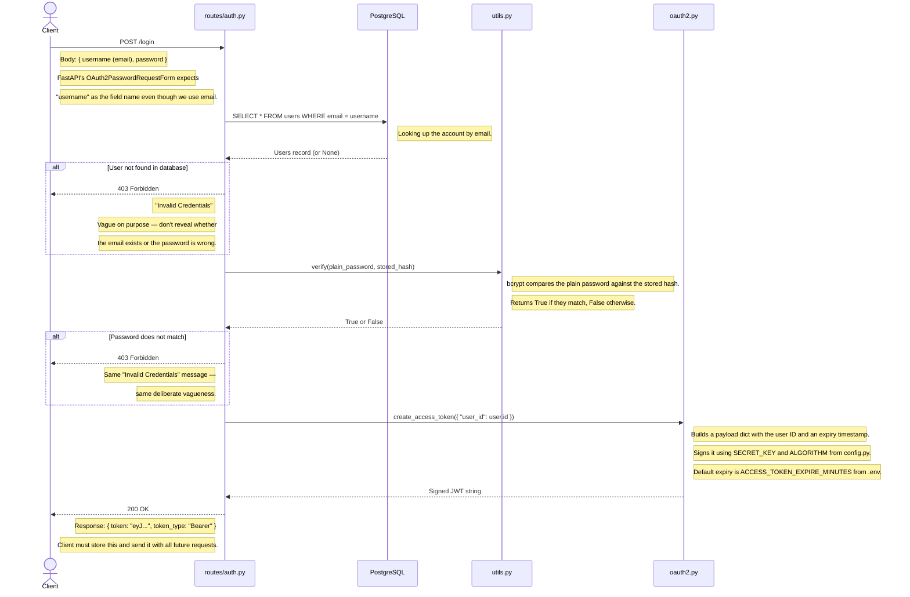
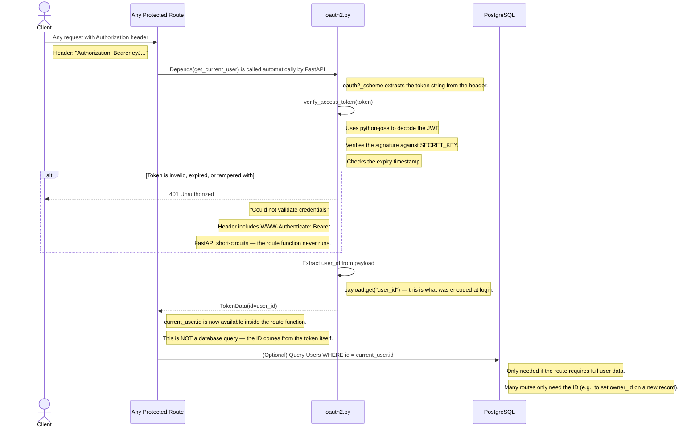
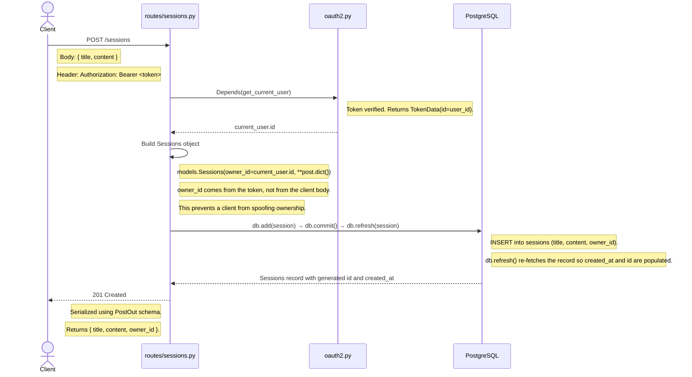
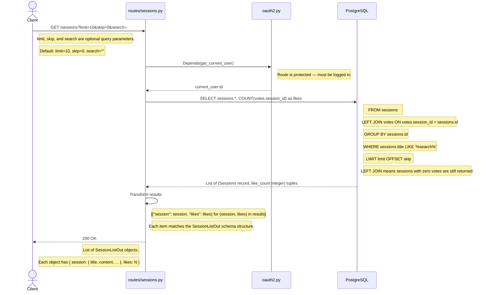
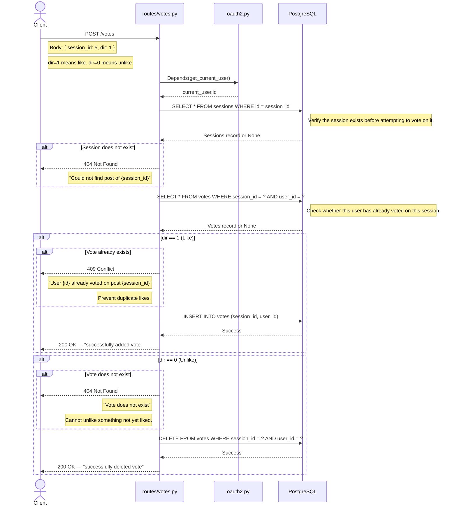
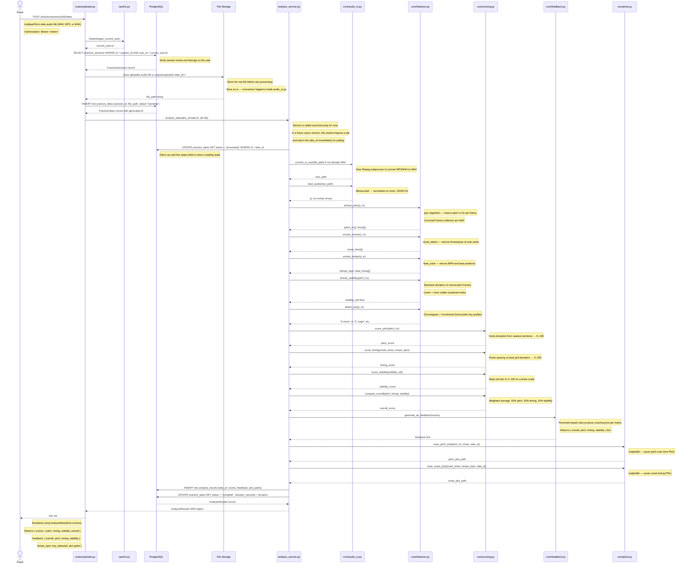

# 05 — Sequence Diagrams

**Who this is for:** A developer who needs to trace exactly what happens — step by step, file by file — when a specific API request comes in. These diagrams are the reference for debugging unexpected behavior, understanding auth flow, or knowing what database queries are being made and when.

**Where to find the code:** Each participant label maps directly to a file in `api/app/`.

| Diagram participant | File location |
|---|---|
| `routes/auth.py` | `api/app/routes/auth.py` |
| `routes/users.py` | `api/app/routes/users.py` |
| `routes/sessions.py` | `api/app/routes/sessions.py` |
| `routes/votes.py` | `api/app/routes/votes.py` |
| `routes/uploads.py` | `api/app/routes/uploads.py` (planned) |
| `oauth2.py` | `api/app/oauth2.py` |
| `utils.py` | `api/app/utils.py` |
| `analysis_service.py` | `api/app/services/analysis_service.py` (planned) |
| `core/` | `api/app/core/` (planned) |
| `PostgreSQL` | The database, accessed via SQLAlchemy in `database/session.py` |
| `File Storage` | Local `outputs/` directory (planned S3) |

---

## How to Read These Diagrams

- **Arrows going right (→):** A call or request being made.
- **Arrows going left (--→):** A return value or response.
- **`alt` blocks:** Conditional branches — the diagram shows what happens in each case.
- **`Note` boxes:** Explain what is happening at that step and why.
- Participants are labeled by their file name so you can open the file directly while reading.

---

## 1. User Registration

**What it does:** Creates a new user account. The password is hashed before it ever reaches the database. The client never receives the hashed password back.

**Why hashing matters:** If the database is ever compromised, bcrypt-hashed passwords cannot be reversed into the original password. The `hash_password()` function in `utils.py` handles this using passlib's bcrypt implementation.

---

## 2. User Login — JWT Authentication

**What it does:** Verifies the user's email and password, then issues a signed JWT token. All subsequent protected requests must include this token.

**Why JWT?** JSON Web Tokens are stateless — the server does not store session data. The token itself contains the user's ID in its payload, and the signature (using the `SECRET_KEY` from `.env`) proves it hasn't been tampered with. This means the API can scale horizontally without a shared session store.

**Where the token goes:** The client stores this token and includes it in the `Authorization: Bearer <token>` header on every subsequent request. See diagram 3 for how protected routes verify it.

---

## 3. Authenticated Request — How Token Verification Works

**What it does:** Every protected route uses `Depends(oauth2.get_current_user)` to verify the incoming token before running any business logic. This diagram shows what happens inside that dependency on every protected request.

**Why this is important:** Understanding this flow is critical because `get_current_user` currently returns a `TokenData` object (just the user ID), not a full `Users` object. This means routes that call `current_user.id` are using the ID from the token — not from a database query. If you need the full user record inside a route, you need to query the database separately using that ID.

---

## 4. Create a Practice Session

**What it does:** Creates a new session record owned by the authenticated user. The `owner_id` is taken from the JWT token — the client does not send it. This prevents a user from creating sessions on behalf of other users.

---

## 5. Get All Sessions (with Like Counts)

**What it does:** Returns a paginated list of sessions with their like counts. Uses a SQL JOIN to count votes efficiently — one query instead of N+1 queries.

**Why the JOIN matters:** A naive approach would be to fetch all sessions and then loop over them, counting votes for each one separately. That is an N+1 query problem — 10 sessions means 11 database round trips. The JOIN approach fetches everything in a single query regardless of how many sessions exist.

---

## 6. Vote on a Session (Like / Unlike)

**What it does:** Adds or removes a vote (like) on a session. Uses `dir=1` to like and `dir=0` to unlike. The composite primary key on `Votes` enforces one vote per user per session at the database level.

**Why check for existing votes in the application?** Even though the database would reject a duplicate insert (due to the primary key), catching it in the application first allows us to return a meaningful 409 Conflict response instead of an unhandled database error.

---

## 7. Audio Upload and Analysis (Planned)

**What it does:** This is the core AI flow of the application. A user uploads an audio file, the system saves it, triggers the analysis pipeline, and returns scores and coaching feedback. This flow does not exist yet — it represents the intended behavior once the audio pipeline (`core/` files and `analysis_service.py`) is implemented.

**Why the status field on `PracticeTakes` matters:** The take is created with `status="pending"` as soon as the file is saved. Before any audio processing begins, it is updated to `"processing"`. When analysis completes, it becomes `"complete"`. If anything fails, it becomes `"failed"`. This means the client can always query the take's status and know exactly where in the pipeline it is — even if the analysis is running asynchronously in the future.

**Where to implement this:** Start with `core/audio_io.py`, then `core/features.py`, then `core/scoring.py`, then `core/feedback.py`, then wire them together in `services/analysis_service.py`. The route in `routes/uploads.py` should be the last piece. See `06_data_pipeline.md` for the full implementation spec.

