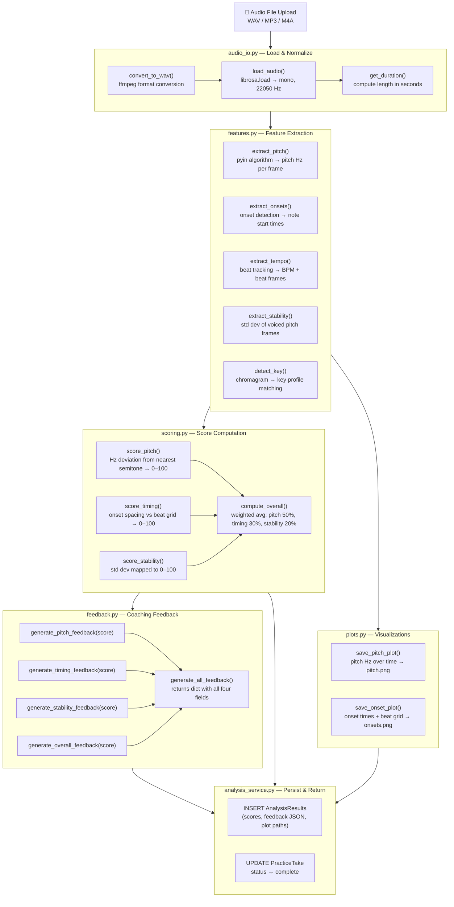
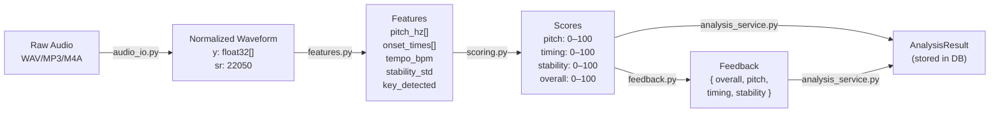

# 06 — Audio Data Pipeline

## Purpose

This document defines the design of the audio analysis pipeline — the core AI/ML component of Music Practice Companion. The pipeline takes a raw audio recording as input and produces performance scores and coaching feedback as output.

The pipeline is **not yet implemented**. This document serves as the engineering specification to build from.

---

## Pipeline Overview



---

## Step-by-Step Design

### Step 1 — audio_io.py

**Responsibility:** Accept any supported audio format and normalize it to a consistent waveform for downstream processing.

| Function | Input | Output | Library |
|---|---|---|---|
| `convert_to_wav(input_path, output_path)` | Any audio file path | WAV file path | ffmpeg (subprocess) |
| `load_audio(file_path)` | WAV file path | `(y, sr)` numpy arrays | librosa |
| `get_duration(y, sr)` | waveform + sample rate | float seconds | librosa |

**Normalization target:** mono channel, 22050 Hz sample rate. This is the librosa default and is consistent across all core functions.

---

### Step 2 — features.py

**Responsibility:** Extract meaningful audio properties from the normalized waveform. All functions take `(y, sr)` as input.

| Function | Algorithm | Output | What it measures |
|---|---|---|---|
| `extract_pitch(y, sr)` | pyin (librosa) | `(pitch_hz[], times[])` | Fundamental frequency per frame in Hz. Unvoiced frames = NaN. |
| `extract_onsets(y, sr)` | onset_detect (librosa) | `onset_times[]` | Timestamps (seconds) where notes or beats begin |
| `extract_tempo(y, sr)` | beat_track (librosa) | `(tempo_bpm, beat_times[])` | Estimated BPM and beat positions |
| `extract_stability(pitch_hz)` | numpy std dev | `float` | Std deviation of voiced pitch frames — lower = more stable |
| `detect_key(y, sr)` | chroma_cqt + key profile correlation | `str` e.g. "A minor" | Musical key using Krumhansl-Schmuckler profiles |

**Why pyin over yin?** pyin uses a probabilistic model that is more accurate for vocal and guitar inputs with noise or vibrato. It is the recommended algorithm in librosa for monophonic pitch tracking.

---

### Step 3 — scoring.py

**Responsibility:** Convert raw feature values into normalized 0–100 scores that are intuitive for musicians.

| Function | Input | Algorithm | Output |
|---|---|---|---|
| `score_pitch(pitch_hz)` | pitch track | Convert Hz → MIDI. Compute cents deviation from nearest semitone. Map average deviation to 0–100. | float 0–100 |
| `score_timing(onset_times, tempo_bpm)` | onsets + BPM | Compute expected beat interval. Measure each onset's distance to nearest beat. Map average deviation to 0–100. | float 0–100 |
| `score_stability(stability_std)` | std dev float | Linear scale: 0 std = 100, 20+ std = 0. | float 0–100 |
| `compute_overall(p, t, s)` | three scores | Weighted average: pitch × 0.50, timing × 0.30, stability × 0.20 | float 0–100 |

**Score interpretation:**

| Range | Meaning |
|---|---|
| 90–100 | Excellent — performance-ready |
| 75–89 | Good — minor improvements needed |
| 55–74 | Developing — clear areas to work on |
| 0–54 | Needs significant practice |

---

### Step 4 — feedback.py

**Responsibility:** Translate scores into plain-English coaching feedback a musician can act on. Uses threshold-based rules — no ML required.

Each metric has its own generator function. All four are combined by `generate_all_feedback()` into a dictionary that maps to the `FeedbackOut` Pydantic schema.

```
FeedbackOut {
    overall:   "Strong performance overall. Focus on timing..."
    pitch:     "Pitch is generally accurate but drifts on sustained notes..."
    timing:    "Timing inconsistency detected — try a metronome at 70% tempo..."
    stability: "Sustained notes are stable in the verse, weaker in the chorus..."
}
```

**Future:** Replace threshold rules with an LLM call (e.g. GPT-4o-mini) for more personalized, context-aware feedback. The function signature stays the same — only the internals change.

---

### Step 5 — plots.py

**Responsibility:** Generate visualizations that let the user see their performance visually.

| Plot | X axis | Y axis | What it shows |
|---|---|---|---|
| `pitch.png` | Time (seconds) | Frequency (Hz) | Pitch track over time. Gaps = unvoiced frames. Flat = stable. |
| `onsets.png` | Time (seconds) | Amplitude | Waveform with onset markers overlaid. Shows where notes begin. |

Saved to a per-take folder under `outputs/sessions/<take_id>/`.

---

### Step 6 — analysis_service.py (Orchestrator)

**Responsibility:** The only file that knows about both the core pipeline AND the database. Routes call this. Core functions do not.

```
analyze_take(take_id, db):
    1. Load PracticeTake from DB
    2. Set status → "processing"
    3. Convert and load audio
    4. Extract all features
    5. Compute all scores
    6. Generate feedback dict
    7. Save plots
    8. INSERT AnalysisResults into DB
    9. UPDATE PracticeTake status → "complete"
   10. Return AnalysisResults object
```

If any step fails, the take status is set to `"failed"` and the exception is re-raised so the route can return a 500 with context.

---

## Data Flow Summary



---

## Implementation Order

Build and test these files in this exact order. Each step depends only on the one before it.

1. `audio_io.py` — test with a sample WAV file, confirm `(y, sr)` output shape
2. `features.py` — test each extractor on the same file, print raw values
3. `scoring.py` — unit test each scorer with known inputs and expected outputs
4. `feedback.py` — already fully implementable (pure string logic, no audio needed)
5. `plots.py` — generate and visually inspect pitch.png and onsets.png
6. `analysis_service.py` — integration test: upload a file, assert a complete AnalysisResult is persisted

---

## Future Enhancements

| Enhancement | Description | When |
|---|---|---|
| Async job queue | Move `analyze_take()` into a Celery worker so the upload endpoint returns immediately with a job ID | When audio files are long enough to cause timeout issues |
| S3 audio storage | Replace local file paths with S3 presigned URLs | When deploying to production at scale |
| Reference track comparison | Accept a reference track alongside the user's take and compare pitch/timing against it | After core pipeline is stable |
| ML-based scoring | Replace heuristic thresholds with trained scikit-learn classifiers | After collecting enough labeled takes |
| LLM feedback | Replace threshold feedback with GPT-4o-mini for personalized coaching | After core pipeline is validated |
| Real-time recording | WebSocket-based in-browser recording | Frontend phase |
