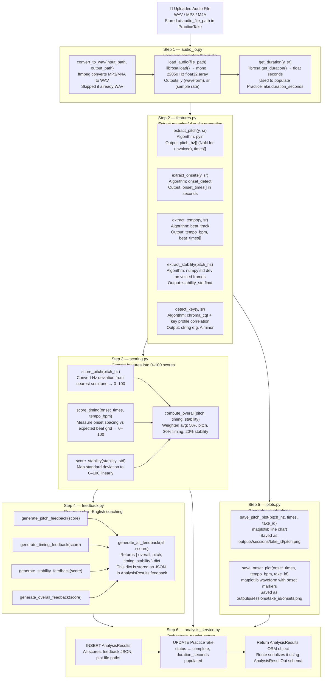
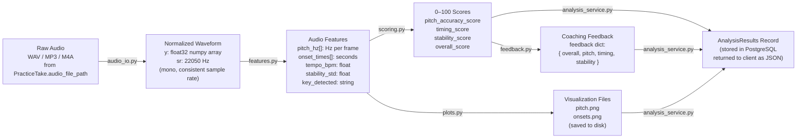

# 06 — Audio Data Pipeline

**Who this is for:** A developer who needs to implement the audio analysis engine — the core AI/ML component of this application. This document is the engineering specification. It explains what each function does, why each algorithm was chosen, what the inputs and outputs are, and in what order to build and test each piece.

**Where to find the code:** All pipeline files live in `api/app/core/`. The orchestrator that coordinates them lives in `api/app/services/analysis_service.py`. All files currently exist but are empty — this document defines what goes in them.

**Important rule:** Files in `core/` must never import from FastAPI, SQLAlchemy, or any other framework. They only import Python standard library, NumPy, SciPy, librosa, scikit-learn, and matplotlib. This is what makes them independently testable and reusable.

---

## What the Pipeline Does

A musician uploads an audio recording. The pipeline converts it into a normalized waveform, extracts audio features (pitch, rhythm, vocal stability), converts those features into interpretable 0–100 scores, generates plain-English coaching feedback, and saves visualizations. The result is stored in the database and returned to the client.

The pipeline is designed to be **synchronous for now** — the route waits for analysis to complete before responding. In a future version, this can become asynchronous (Celery + Redis) by wrapping `analyze_take()` in a task queue without changing any of the core functions.

---

## Full Pipeline Flowchart



---

## Step 1 — `audio_io.py` — Load and Normalize Audio

**File:** `api/app/core/audio_io.py`

**Why this step exists:** Users can upload audio in different formats (WAV, MP3, M4A) and recorded at different sample rates (44100 Hz from most phone recordings, 48000 Hz from some DAWs, etc.). librosa's feature extraction functions expect a consistent mono waveform at a specific sample rate. This step enforces that consistency before any analysis begins.

**Why 22050 Hz?** This is librosa's default sample rate. It captures all frequencies a human can hear (up to 20 kHz by Nyquist theorem at 40 kHz, though 22050 Hz is more than sufficient for vocal and guitar frequencies which rarely exceed 5–6 kHz). Lower sample rates mean faster processing with no loss of relevant musical information.

| Function | Input | Output | Library | Purpose |
|---|---|---|---|---|
| `convert_to_wav(input_path, output_path)` | Any audio file path | WAV file path | ffmpeg via subprocess | Convert MP3/M4A to WAV. ffmpeg is a system dependency, not a pip package. |
| `load_audio(file_path)` | WAV file path | `(y, sr)` — float32 numpy array + int | librosa | Load waveform. librosa.load() automatically downsamples to 22050 Hz and converts to mono. |
| `get_duration(y, sr)` | waveform, sample rate | float seconds | librosa | Compute audio length. Used to populate `PracticeTake.duration_seconds`. |

---

## Step 2 — `features.py` — Extract Audio Features

**File:** `api/app/core/features.py`

**Why this step exists:** Raw audio waveforms are just arrays of amplitude values over time. They contain no directly usable information about pitch, timing, or stability. Feature extraction is the process of converting this raw signal into structured measurements that can be scored and explained to the musician.

**All functions in this file take `(y, sr)` as input** — the normalized waveform from `audio_io.load_audio()`. Never call these functions directly on an un-normalized or un-converted file.

### `extract_pitch(y, sr)` — Pitch Tracking

**Why pyin instead of yin or other methods?** pyin (probabilistic YIN) is librosa's most accurate monophonic pitch tracker. It handles noise, vibrato, and rests better than the older yin algorithm by using a probabilistic model to distinguish voiced frames (notes being sung/played) from unvoiced frames (silence, breath, room noise). Unvoiced frames are returned as `NaN` so the scoring function can filter them out cleanly.

| Detail | Value |
|---|---|
| Algorithm | `librosa.pyin()` |
| `fmin` | `librosa.note_to_hz("C2")` ≈ 65 Hz — lowest expected note (bass guitar low E) |
| `fmax` | `librosa.note_to_hz("C7")` ≈ 2093 Hz — highest expected note (high soprano) |
| Output | `pitch_hz[]` — fundamental frequency per frame. NaN = unvoiced. `times[]` — corresponding timestamps in seconds |

### `extract_onsets(y, sr)` — Note Start Detection

**Why onset detection?** Onset times tell us when notes begin. By comparing the spacing of onsets to the expected beat grid (from tempo detection), we can measure whether the musician is playing on time or drifting early and late.

| Detail | Value |
|---|---|
| Algorithm | `librosa.onset.onset_detect()` |
| Output | `onset_times[]` — array of timestamps in seconds where notes begin |

### `extract_tempo(y, sr)` — Tempo and Beat Tracking

**Why tempo?** The detected BPM establishes the expected beat grid. Without it, we have no reference to compare onset timing against. The beat positions are also used in the onset timing plot.

| Detail | Value |
|---|---|
| Algorithm | `librosa.beat.beat_track()` |
| Output | `tempo_bpm` — estimated BPM as float. `beat_times[]` — beat positions in seconds |

### `extract_stability(pitch_hz)` — Vocal/Instrumental Stability

**Why stability?** A musician who sings or plays a sustained note might waver in pitch — this is different from being out of tune. A singer might be on the right note but wobble around it (poor stability) versus being consistently flat (poor pitch accuracy). Stability is the standard deviation of voiced pitch frames. Lower deviation = steadier notes.

| Detail | Value |
|---|---|
| Algorithm | `numpy.std()` on voiced (non-NaN) frames of `pitch_hz` |
| Output | `stability_std` — a float. Small value = stable. Large value = unstable. |

### `detect_key(y, sr)` — Musical Key Detection

**Why detect key?** Knowing the key allows the feedback system to say things like "you're consistently sharp on the 3rd of the scale" in future versions. For now, it is stored in `AnalysisResults.key_detected` for display purposes.

| Detail | Value |
|---|---|
| Algorithm | `librosa.feature.chroma_cqt()` + Krumhansl-Schmuckler key profile correlation |
| Output | String e.g. `"A minor"`, `"C major"` |

---

## Step 3 — `scoring.py` — Convert Features to Scores

**File:** `api/app/core/scoring.py`

**Why this step exists:** Raw feature values (pitch in Hz, onset times in seconds, stability as standard deviation) are not meaningful to a musician. A musician cannot act on "your average pitch deviation was 0.23 semitones." They can act on "your pitch accuracy is 71/100 — practice holding sustained notes with a drone note." This step converts raw numbers into a consistent, interpretable 0–100 scale.

**Why 0–100?** Universal intuition — every musician understands a score out of 100. It is also easy to set thresholds in the feedback layer (90+ = excellent, 75–89 = good, etc.).

| Function | Algorithm | Score Meaning |
|---|---|---|
| `score_pitch(pitch_hz)` | Convert Hz → MIDI continuous values. Compute absolute cents deviation from nearest semitone. Average the deviations. Map average to 0–100 (0 cents = 100, 50+ cents = 0). | How in-tune the overall performance was. |
| `score_timing(onset_times, tempo_bpm)` | Compute expected beat interval from BPM (60 / tempo). For each onset, find distance to nearest expected beat. Average distances. Map to 0–100. | How consistently on-beat the performance was. |
| `score_stability(stability_std)` | Linear map: std=0 → 100, std≥20Hz → 0. | How steady sustained notes were. |
| `compute_overall(p, t, s)` | `(p × 0.50) + (t × 0.30) + (s × 0.20)` | Single summary score. Pitch weighted highest because it is most musically critical. |

### Score Interpretation Guide

| Range | Label | Meaning for the musician |
|---|---|---|
| 90–100 | Excellent | Performance-ready. Minor refinements only. |
| 75–89 | Good | Solid performance with identifiable areas to improve. |
| 55–74 | Developing | Clear weaknesses. Targeted practice will make a significant difference. |
| 0–54 | Needs Work | Foundational skills need attention before the full piece. |

---

## Step 4 — `feedback.py` — Generate Coaching Feedback

**File:** `api/app/core/feedback.py`

**Why this step exists:** Scores alone tell a musician how they did. Feedback tells them what to do about it. The goal is to produce coaching text that sounds like a patient, knowledgeable tutor — specific, actionable, and encouraging even when critical.

**Why threshold-based rules instead of ML?** Rule-based feedback is explainable, predictable, and testable. It can be implemented with zero training data. Once the pipeline is running and real recordings are being processed, the feedback quality can be improved iteratively — or replaced entirely with an LLM call (e.g., GPT-4o-mini) by swapping the internals of `generate_all_feedback()` without changing any other function signature.

**This file has no dependency on audio data.** It only takes score floats as input and returns strings. This means it can be implemented and tested immediately, before any audio processing is written.

| Function | Input | Output |
|---|---|---|
| `generate_pitch_feedback(score)` | float 0–100 | Coaching string for pitch accuracy |
| `generate_timing_feedback(score)` | float 0–100 | Coaching string for timing consistency |
| `generate_stability_feedback(score)` | float 0–100 | Coaching string for note stability |
| `generate_overall_feedback(score)` | float 0–100 | Summary coaching string |
| `generate_all_feedback(p, t, s, o)` | four floats | Dict `{ overall, pitch, timing, stability }` — stored as JSON in `AnalysisResults.feedback` |

**Example output for a score of 68 on pitch:**
> "Pitch accuracy needs work. Slow the section down and practice each phrase in isolation with a reference track or piano."

---

## Step 5 — `plots.py` — Generate Visualizations

**File:** `api/app/core/plots.py`

**Why this step exists:** Scores and text feedback explain the result analytically. Visualizations make the result visceral — a musician can see exactly where their pitch drifted, or exactly which note they rushed. The plots are saved as PNG files per take and their file paths are stored in `AnalysisResults`.

**Why save to disk instead of returning the image directly?** Storing the path in the database means the image can be served or regenerated on demand without re-running analysis. It also makes it easier to migrate to S3 later — the path string in the database just becomes an S3 key instead of a local path.

| Plot | What it shows | Why it helps |
|---|---|---|
| `pitch.png` | Pitch in Hz over time. Gaps are unvoiced frames. Flat horizontal stretches = stable notes. | Musician can see exactly where pitch wavered or drifted. |
| `onsets.png` | Audio waveform with vertical markers at each detected onset, overlaid with the expected beat grid. | Musician can see whether they are rushing or dragging relative to the beat. |

---

## Step 6 — `analysis_service.py` — Orchestrate and Persist

**File:** `api/app/services/analysis_service.py`

**Why this step exists:** The `core/` functions are pure — they do no I/O, no database writes, no status updates. Something needs to coordinate the sequence, handle errors gracefully, persist results, and update the take's status throughout. That is `analysis_service.py`. It is the only file that knows about both the audio core functions AND the database.

**Error handling design:** If any step fails (corrupt audio, ffmpeg not installed, librosa exception), the service catches the exception, sets `PracticeTake.status = "failed"`, commits that to the database, then re-raises. This ensures the take is never left stuck in `"processing"` state — the client can always query the status and get a definitive answer.

```
analyze_take(take_id, db):

  1. Fetch PracticeTake from DB — raise ValueError if not found
  2. Set take.status = "processing" — commit
  3. Convert to WAV if needed (audio_io.convert_to_wav)
  4. Load audio (audio_io.load_audio) → (y, sr)
  5. Get duration (audio_io.get_duration) → float seconds
  6. Extract pitch (features.extract_pitch) → (pitch_hz, times)
  7. Extract onsets (features.extract_onsets) → onset_times
  8. Extract tempo (features.extract_tempo) → (tempo_bpm, beat_times)
  9. Extract stability (features.extract_stability) → stability_std
  10. Detect key (features.detect_key) → key string
  11. Score pitch (scoring.score_pitch) → pitch_score
  12. Score timing (scoring.score_timing) → timing_score
  13. Score stability (scoring.score_stability) → stability_score
  14. Compute overall (scoring.compute_overall) → overall_score
  15. Generate all feedback (feedback.generate_all_feedback) → feedback_dict
  16. Save pitch plot (plots.save_pitch_plot) → pitch_plot_path
  17. Save onset plot (plots.save_onset_plot) → onset_plot_path
  18. INSERT AnalysisResults into DB (all scores, JSON feedback, plot paths)
  19. UPDATE PracticeTake — status="complete", duration_seconds=duration
  20. Return AnalysisResults ORM object

  On any exception between steps 3–19:
    → SET take.status = "failed" — commit
    → raise RuntimeError with context
```

---

## Data Flow Summary



---

## Implementation Order

Build and test in this exact sequence. Each step depends only on the step before it. Do not skip ahead.

| Order | File | What to build first | How to test |
|---|---|---|---|
| 1 | `core/feedback.py` | All four `generate_*_feedback()` functions — no audio needed, just string logic | Unit test: call each function with known scores (0, 50, 90), assert the response is a non-empty string |
| 2 | `core/audio_io.py` | `load_audio()` first, then `get_duration()`, then `convert_to_wav()` | Test: load a real WAV file, assert output shape `(N,)` and sr=22050 |
| 3 | `core/features.py` | `extract_pitch()` first (most important), then onsets, tempo, stability, key | Test: load a test WAV, call each extractor, print the raw output and verify it makes sense |
| 4 | `core/scoring.py` | `score_pitch()` first, then timing, stability, overall | Unit test: call each with known inputs and assert the score is in [0, 100] |
| 5 | `core/plots.py` | `save_pitch_plot()` first, then onset plot | Test: generate a plot from test feature data, open the PNG and visually inspect it |
| 6 | `services/analysis_service.py` | Wire steps 1–5 together with DB persistence | Integration test: upload a real WAV, assert a complete AnalysisResults record exists in the DB |
| 7 | `routes/uploads.py` | The upload endpoint that calls `analyze_take()` | End-to-end test via Swagger UI or pytest: upload a file, assert 200 response with scores |

---

## Future Enhancements

| Enhancement | What it adds | When to build it |
|---|---|---|
| **Async job queue (Celery + Redis)** | Upload endpoint returns immediately with a job ID. Client polls `GET /practice/takes/{id}/status` until `status="complete"`. Removes timeout risk for long recordings. | When audio files are long enough to exceed request timeout limits (~30s) |
| **S3 audio storage** | Replace local file paths with S3 presigned URLs. Audio is stored in the cloud, not on the EC2 disk. | When moving to production at scale or adding multiple EC2 instances |
| **Reference track comparison** | User uploads a reference audio track (original song). Pipeline compares pitch and timing of the take against the reference. Enables note-level accuracy feedback. | After core pipeline is stable and tested |
| **ML-based scoring (scikit-learn)** | Replace heuristic thresholds in `scoring.py` with trained classifiers. Requires labeled training data (human-rated takes). scikit-learn is already in `requirements.txt`. | After collecting enough real user recordings |
| **LLM feedback (GPT-4o-mini)** | Replace threshold-based feedback strings with a prompt that sends scores + audio features to an LLM and receives personalized, context-aware coaching. Only `generate_all_feedback()` changes — no other code is affected. | After validating that the core scoring pipeline is accurate |
| **Real-time recording** | WebSocket endpoint that streams audio chunks, processes them incrementally, and returns live pitch feedback. Enables in-browser recording with real-time tuner display. | Frontend phase (React) |
